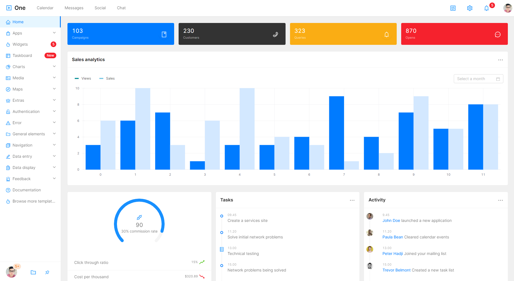

# One_Admin

# Run project

# One is a React and Next.js project written in javascript. Prerequisite knowledge of React and javascript is required.

You get all on your SAAS, CRM, CMS or dashboard based project.
npm run dev or yarn dev

/////

yarn build

yarn start

